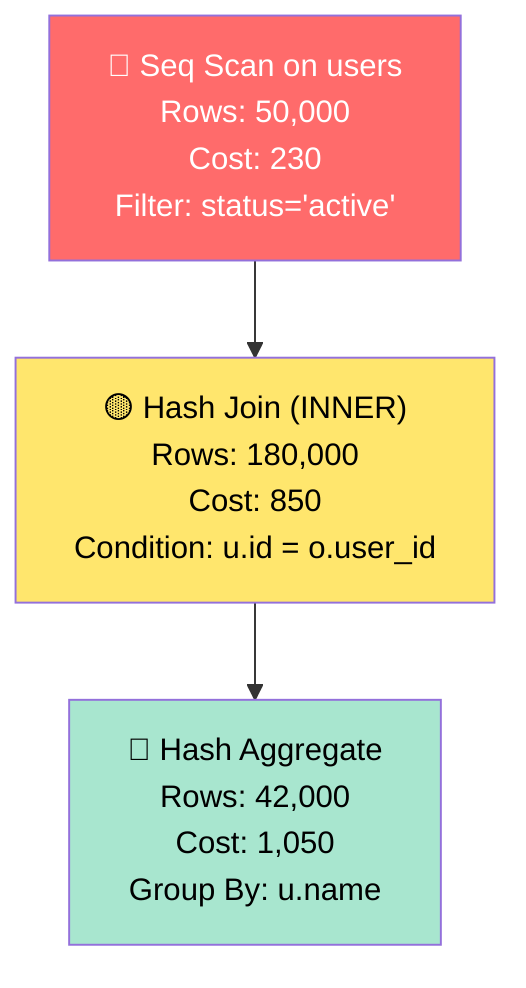

# vizql — Visual SQL Explainer

[](https://pypi.org/project/vizql/)
[](https://pypi.org/project/vizql/)
[](LICENSE)
[](https://github.com/hemv-857/vizql/stargazers)

> **See your SQL run.** Paste SQL, get an animated dataflow diagram that shows exactly how the database executes it — with bottlenecks highlighted.

---

## 🎬 Demo

```
$ vizql explain "SELECT u.name, COUNT(*) FROM users u JOIN orders o ON u.id=o.user_id GROUP BY u.name"
```


*Terminal animation showing step-by-step execution with row counts and costs*

---

## ✨ Features

| Feature | Description |
|---------|-------------|
| **Multi-dialect** | PostgreSQL, MySQL, Snowflake, BigQuery, DuckDB, Spark, T-SQL |
| **Visual plans** | Mermaid diagrams, Graphviz SVG, animated terminal |
| **Bottleneck detection** | Seq scans, hash join spills, sort spills, missing indexes |
| **Smart suggestions** | Index recommendations, query rewrites, config tuning |
| **Regression detection** | CI/CD integration to catch slow queries before deploy |
| **Zero-DB mode** | Simulates execution without a database connection |

---

## 🚀 Quick Start

```bash
# Install
pipx install vizql
# or
pip install vizql

# Explain a query
vizql explain "SELECT * FROM users WHERE email = 'test@example.com'"

# From file
vizql explain --file query.sql --dialect postgres

# Check for regressions (CI/CD)
vizql check --compare main --db postgresql://localhost/mydb
```

---

## 📸 Screenshots

### Terminal Output
```
$ vizql explain "SELECT u.name FROM users u JOIN orders o ON u.id=o.user_id"

🔴 Seq Scan on users
  Rows: 50.0K | Cost: 230 | Filter: status='active'
  ⚠️  No index on status column

  ↓

🟡 Hash Join (INNER)
  Rows: 180.0K | Cost: 850 | Condition: u.id = o.user_id
  💡 Build side 1.2M rows — may spill to disk

  ↓

🔵 Hash Aggregate
  Rows: 42.0K | Cost: 1,050 | Group By: u.name

Total: 2,130 cost units | Max Memory: 340MB
```

### Mermaid Diagram (renders in GitHub/GitLab/Notion/Obsidian)


---

## 🛠 Commands

### `vizql explain` — Explain a query
```bash
# From stdin
echo "SELECT * FROM users" | vizql explain

# From file
vizql explain --file query.sql --dialect snowflake

# Output formats
vizql explain "SELECT 1" --format mermaid      # Mermaid diagram
vizql explain "SELECT 1" --format graphviz      # Graphviz DOT
vizql explain "SELECT 1" --format json          # JSON for tools
vizql explain "SELECT 1" --format terminal      # Rich terminal (default)

# Animation
vizql explain "SELECT 1" --animate              # Step-by-step animation
```

### `vizql check` — Detect regressions
```bash
# Compare against main branch
vizql check --compare main --db postgresql://localhost/db

# Custom threshold (default 1.5 = 50% increase)
vizql check --threshold 2.0 --db $DATABASE_URL

# CI/CD mode (exits with code 1 on regression)
vizql check --compare main --db $DATABASE_URL || exit 1
```

### `vizql diff` — Compare two queries
```bash
vizql diff "SELECT * FROM a" "SELECT * FROM a WHERE x=1"
```

---

## 🎯 Use Cases

### 1. **Code Review** — Catch slow queries in PRs
```yaml
# .github/workflows/sql-check.yml
- uses: actions/checkout@v4
  with: { fetch-depth: 0 }
- run: pip install vizql
- run: vizql check --compare main --db ${{ secrets.STAGING_DB }}
```

### 2. **Local Development** — Understand query performance
```bash
# Before committing
vizql check --compare main --db postgresql://localhost/dev
```

### 3. **Learning SQL** — Visualize execution
```bash
vizql explain "SELECT * FROM users JOIN orders..." --animate
```

### 4. **Cross-Dialect Migration** — See plan differences
```bash
vizql diff --from postgres --to snowflake query.sql
```

---

## 🏗 Architecture

```
┌─────────────────────────────────────────────────────────────┐
│                        vizql CLI                              │
├─────────────────────────────────────────────────────────────┤
│  sqlglot (parse) → planner (logical plan) → optimizer       │
│         │                              │                    │
│         ▼                              ▼                    │
│  ┌─────────────┐              ┌─────────────────┐          │
│  │ Dialect     │              │ Cost model      │          │
│  │ normalizer  │              │ (per-dialect)   │          │
│  └─────────────┘              └─────────────────┘          │
│         │                              │                    │
│         └──────────────┬───────────────┘                    │
│                        ▼                                    │
│         ┌─────────────────────────┐                         │
│         │  Execution Simulator    │  ← animates row counts │
│         │  (no DB needed!)        │  ← estimates via stats │
│         └─────────────────────────┘                         │
│                        │                                    │
│         ┌──────────────┼──────────────┐                     │
│         ▼              ▼              ▼                     │
│   ┌──────────┐  ┌──────────┐  ┌──────────┐                 │
│   │ Mermaid  │  │  SVG/    │  │  TUI     │  ← three renders│
│   │  /DOT    │  │  Graphviz│  │  (Ratatui)│                 │
│   └──────────┘  └──────────┘  └──────────┘                 │
└─────────────────────────────────────────────────────────────┘
```

**Key insight:** *No database required.* We simulate execution using:
- `sqlglot` for parsing + transpilation
- Statistics heuristics for row estimates
- Per-dialect cost models

---

## 📦 Installation

### pipx (recommended)
```bash
pipx install vizql
```

### pip
```bash
pip install vizql
```

### From source
```bash
git clone https://github.com/hemv-857/vizql
cd vizql
pip install -e .
```

### Development
```bash
pip install -e ".[dev]"
pytest
```

---

## 🔧 Configuration

Create `~/.vizql.yaml`:
```yaml
dialect: postgres
database_url: postgresql://localhost/mydb
threshold: 1.5
format: terminal
costs: true
warnings: true
suggestions: true
```

Environment variables:
```bash
export VIZQL_DATABASE_URL=postgresql://...
export VIZQL_DIALECT=postgres
export VIZQL_THRESHOLD=1.5
```

---

## 🤝 Contributing

```bash
# Fork & clone
git clone https://github.com/YOUR_USERNAME/vizql
cd vizql

# Create virtual env
python -m venv .venv
source .venv/bin/activate

# Install dev deps
pip install -e ".[dev]"

# Run tests
pytest

# Lint
ruff check .
ruff format .

# Type check
mypy src/vizql
```

### Adding a new dialect
1. Add cost model in `src/vizql/cost_model/`
2. Register in `src/vizql/cost_model/__init__.py`
3. Add tests in `tests/`

---

## 📄 License

MIT — see [LICENSE](LICENSE) for details.

---

## 🙏 Credits

- [sqlglot](https://github.com/tobymao/sqlglot) — SQL parsing & transpilation
- [Rich](https://github.com/Textualize/rich) — Terminal formatting
- [Mermaid](https://mermaid.js.org/) — Diagrams
- [Graphviz](https://graphviz.org/) — Graph visualization

---

## 📬 Contact

- **Issues:** [GitHub Issues](https://github.com/hemv-857/vizql/issues)
- **Discussions:** [GitHub Discussions](https://github.com/hemv-857/vizql/discussions)
- **Author:** [Hemang Varshney](https://github.com/hemv-857)

---

*Built with ❤️ for developers who want to understand their SQL.*